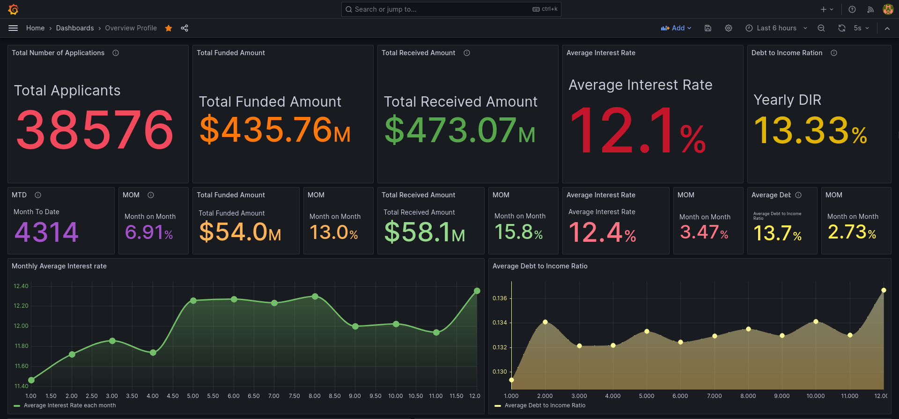
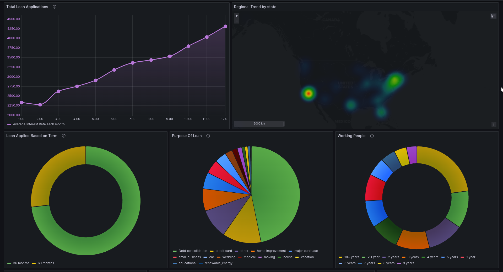
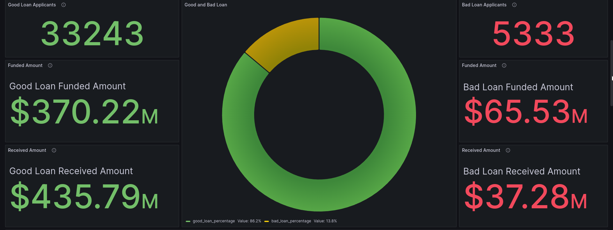
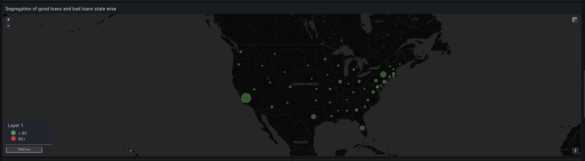
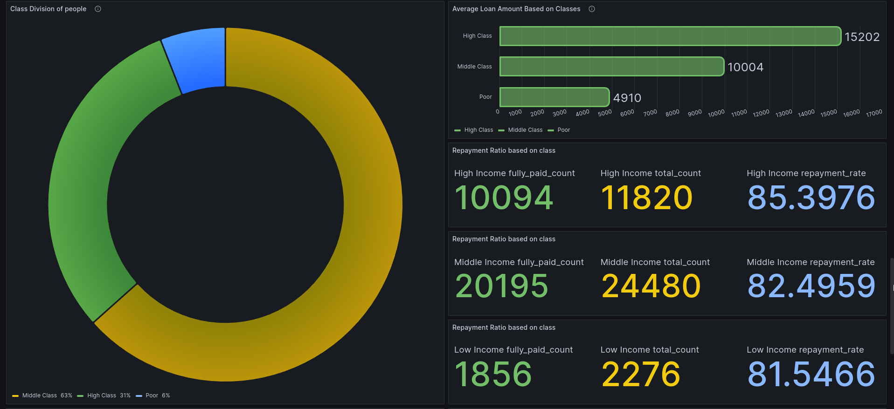
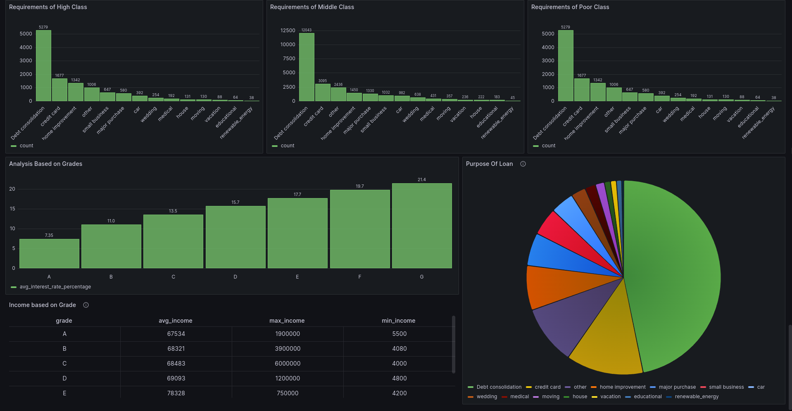

## About the Project
This is a project which focuses on detailed analysis of Bank Loan using Spark, Scala, MySQL and Grafana. The project is divided into 3 parts:
1. Data Analysis using Spark and Scala
2. Data Visualization using Grafana
3. Machine Learning of the data using Spark MLlib

## Data Analysis using Spark and Scala
The data analysis is done using Spark and Scala. The data is read from the MySQL database (refer to instruction.md about how to load the csv file). The data is then analyzed using Spark SQL and Spark Dataframe. The analysis is divided in 3 categories:

1. Overview of the data
2. Based on the Loan division (by the bank)
3. Based on the social status 

## Overview 

The overview of the data is done using Spark SQL. The following are the analysis done:

### Priliminary Analysis 

They include 
* Total number of loans 
* Total funded anount 
* Total received back with interest 
* Average interest rates
* Debt to Income ratio 

All the abouve 5 analysis is done with month to date and month on month comparisons.

Month to date stands for : The total number of loans in the current month till date (eg: 1st Jan to 10th Jan)
Month on month stands for : The total number of loans in the current month till date (eg: 1st Jan to 10th Jan) compared to the previous month (eg: 1st Dec to 10th Dec)

In out dataset all the months were given hence its for entire course of month
   

### Montly Average Interest Rate

* This metric shows the average interest rate for each month. The average interest rate is calculated by taking the average of all the interest rates for each month. 
* One can see that the average interest rate is being stagnant which means that the performance of the bank is good and the bank is not taking any risk.

### Debt to Income Ratio

* This metric shows the debt to income ratio for each month. The debt to income ratio is calculated by taking the average of all the debt to income ratio for each month. 
* The averge good DOI range is from between 10% to 20% and here we have the DOI ratio between 10% to 20% which means that the bank is doing good and all the loans are being carefully analysed before giving it to the customer.

### Total loan application by month

* The total loan application is calculated by taking the sum of all the loan application for each month.
* From the following chart we can say that for a startup bank the amount of loan its giving is increasing which means that the bank is doing good and people are trusting the bank.

### Based on Demographics

* Here we can see the total loan application based on the demographics of the customer. The dataset contains the US state codes and we can see that the most of the customers of the bank is from California and Massachusetts.

### Based on the purpose of the loan

* The dataset contains the purpose of the loan and we can see that the most of the customers of the bank opted for a 36 month term which states that the customers are taking loan for a short period of time.
* Also that the loans which can be in the time frame is very limited that is either 3 years or 5 years.

### Purpose of the loan

* Most of the people that is about 18k applicants out of the total 38.5k are applying loan for debt consolidation which means that the bank is giving loan to people who are in debt and are trying to pay it off. 
* Comparing with the interest rate let us see how the bank is doing in the real market

### Division of loan by grage (working experience)

* Most of the people who are paying their loan off is either 10+ years or 2 years 
* This diversity shows that the people with more work experience are more in investing for their retirement and are paying their loan off.
* Coming to the 2 year and 1 year these are the ones who are just starting their career and are wanting to pay their loan off as soon as possible.

----
----

## GOOD LOAN BAD LOAN

The bank has to decide whether to give loan to a customer or not. The bank has to decide whether the customer is a good customer or a bad customer. 
- To know weather the bank is doing good or not as a customer you must know how good the bank is performing in the market for which from the customer's part we can do the analysis of good vs bad loans.
- From the bank's perspective the bank should realize the flaws in the way the loans are provided and should try to improve it.

### Good Loan

* The good loan is the loan which is paid off by the customer or the customer is currently paying 
* The next row gives the informtion about how much of loan is given for the people under "GOOD" tag
* The next row gives the informtion about how much of loan is been paid off by the people under "GOOD" tag which here is generating a profit about 70 Mil USD

### Bad Loan

* The bad loan is the loan which is defaulted by the customer or the customer is not paying the loan
* The next row gives the informtion about how much of loan is given for the people under "BAD" tag
* The next row gives the informtion about how much of loan is been paid off by the people under "BAD" tag which here is generating a loss about 20 Mil USD

### Division of loan by demographics (state)

* A small analysis based on the current living state of the customer is done to see how the bank is doing in the market on different states. Given that it has to compete with other banks in the market.

**Final verdict: The bank is doing good in the market and is generating a profit of 50 Mil USD**

---
---

## Based on the social status

The bank has to decide whether to give loan to a customer or not, also analyze itself to see how good it is doing in the market. The bank has to decide whether the customer is a good customer or a bad customer, and also maintain its diversity if not the bank will be dominated by a particular group of people.

### Based on the social status
Division of classes will be done based on the following:
* based on the salary or income of the customer
* The salary is divided into 3 classes
    * Low income
    * Middle income
    * High income
* We get those values by dividing the income of the customer into 3 quartiles at 0.333 and 0.66 segregrating the customers into 3 classes

### Division social status

* Inference can be said that most of the loan that is given is either to the people from middle class or the high class which causes the concern for the bank to think about the low class people and try to give them loan as well.

### Average loan amount based on social status and repayment ratio

* The average loan amount is calculated by taking the average of all the loan amount for each class.
* Higher the loan amount higher liquidity in the bank and higher the profit but this also poses a risk for the bank as the customer might not be able to pay the loan back.

* The repayment ratio tells us how much of the loan is paid back by the customer. The higher the better and we can tell that the repayment ratio for the poor class is also high which gives the indication to the bank that it can give loan to the poor class as well.

### Analysis based on requirements 

* Each class has different basic requirements and that analysis can be viewed above 
  * The pattern here is that all the 3 classes are mainly taking loan for debt consolidation and the bank should try to give loan for other purposes as well this can be done by decreasing the interest rate for other purposes. 

### Analysis based on the grade of the loan

Grade (A, B, C, D, E, F, G) is given to the loan based on the risk factor of the loan. Each of this grade has a sub grade (1, 2, 3, 4, 5) which is given based on the risk factor of the loan. The higher the grade the higher the risk factor of the loan. The bank should try to give loan to the people with lower grade as well as they are the ones who are in need of the loan.

the grades are divided as very low, low, medium, high, very high and the sub grades are divided as 1, 2, 3, 4, 5 which is very low, low, medium, high, very high respectively.

* Grade A and B are the ones which are very low risk then comes C and D which are low risk and then comes E and F which are medium risk and finally comes G which is high risk.

* The bank should be very cautious while giving loan to the people with grade G as they are the ones who are very high risk and the bank should try to give loan to the people with grade A and B as they are the ones who are very low risk.

----------

### **This project was made possible by**
* Siddharth
* Abinaya
* Sanjana
* Ronith